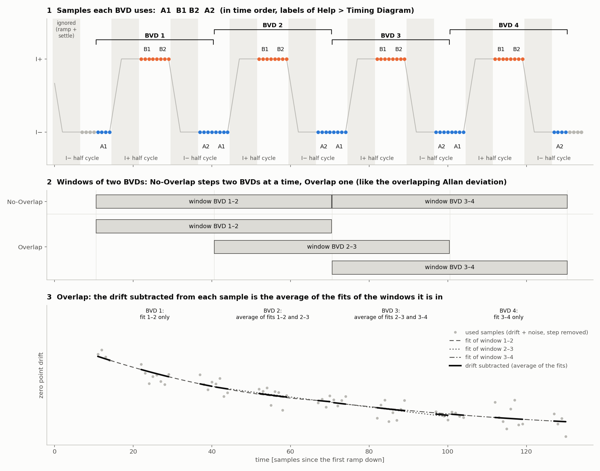
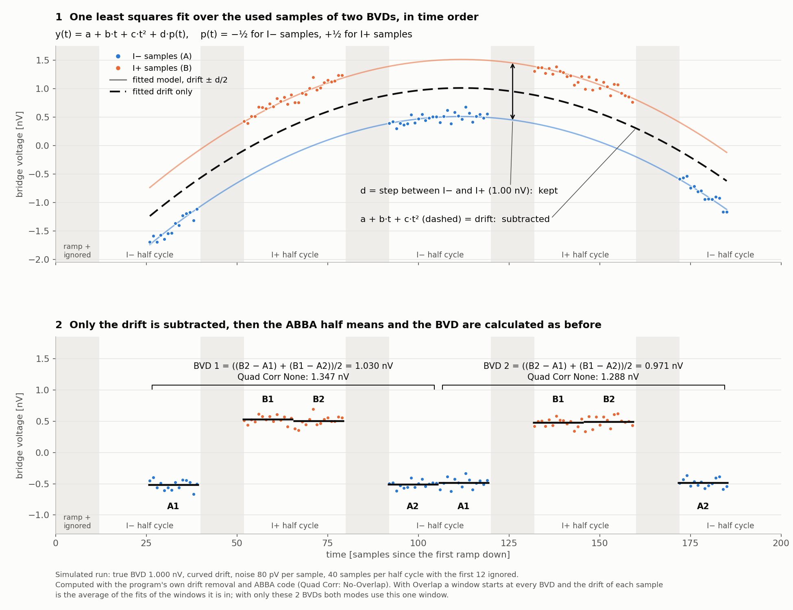

README
======

Data analysis software for the powerful Magnicon CCC system.

Installation
------------
Dependencies can be installed using pip:
``pip install -r requirements.txt``
Optionally, a spec file is provided to build using pyinstaller::
Tested on windows 10 and 11. This is a windows only program as of now.


Usage
-----
If you have python installed on your system then you can call:
```
pip install -r requirements.txt
python Magnicon-Offline-Analyzer.py
```
Optionally to show the help menu:
``python Magnicon-Offline-Analyzer.py -h``

If you are running the exe and want to see the help menu\
Enter this in the cmd window
``Magnicon-Offline-Analyzer.exe -h | more``
This will launch the splash screen and show the help menu once the program is finished \ loading. For now there is no way to not show the splash screen but I am trying to fix \
this for future releases. Supported options are shown below
```
Configure Magnicon-Offline-Analyzer

options:
  -h, --help            show this help message and exit
  -db DB_PATH, --db_path DB_PATH
                        Specify resistor database directory
  -l LOG_PATH, --log_path LOG_PATH
                        Specify log directory
  -d, --debug           Debugging mode
  -s SITE, --site SITE  Site where this program is used
  -c SPECIFIC_GRAVITY, --specific_gravity SPECIFIC_GRAVITY
                        Specific gravity of oil for oil type resistors

A utility to interact with the analysis software for Magnicon CCC systems

```

DB_PATH is the path to the resistor database directory\
In debugging mode, debug logs are saved to the log file specfied by the LOG_PATH

How the program works
---------------------
The program opens one run of the Magnicon CCC software, calculates the bridge voltage differences (BVDs) again from
the raw bridge voltage samples, turns them into the value of the unknown resistor and shows checks, statistics and
plots. The results can be saved as files for the MDSS database.

### Files of a run
Open a run with File > Open... (Ctrl+O) and select its `_bvd.txt` file. The other files of the run must be in the
same folder:

* `<run>.txt`: the raw bridge voltage samples with the phase of each sample (I-, I+ or ramping), the number of
  samples per half cycle (SHC), the ignored first and last samples, the integration time, the start and stop time,
  the resistor serial numbers and the remarks
* `<run>_bvd.txt`: the BVDs calculated by the Magnicon software (used for the Chk values), delta N1/NA (used for k)
  and delta(I2R2)
* `<run>_cccdrive.cfg`: the bridge settings: nominal values, currents I1 and I2, windings N1, N2 and NA, ramp,
  number of cycles, range shunt, DACs, calibration mode, compensation (CN) output and screen voltage

A warning is shown when the calibration mode or the compensation is off, the 16 bit DAC is not 0, the screen
voltage is off or the network resistor database cannot be reached.

### From raw samples to BVDs (ABBA)
The raw samples are split into I- (A) and I+ (B) half cycles of SHC samples. The samples at the start of every half
cycle, during the ramp and while the bridge settles, are left out (Ignored First), and so are the last ones (Ignored
Last). The used samples of every half cycle are split into a first and a second half, and the mean of each half is
taken. Every cycle gives one BVD from four of these means, labelled as in Help > Timing Diagram:

* A1: the second half of the I- half cycle
* B1, B2: the first and the second half of the I+ half cycle after it
* A2: the first half of the next I- half cycle

```
C1 = B2 - A1        (the second halves)
C2 = B1 - A2        (the first halves)
BVD = (C1 + C2) / 2 = ((B2 - A1) + (B1 - A2)) / 2
```
The first half of an I- half cycle is A2 of the BVD before it and its second half is A1 of the BVD after it. A1 comes
before the B samples and A2 after them, so the A and the B samples have the same average time and a constant offset
or a linear drift of the bridge voltage cancels in the BVD.

C1 - C2 compares the second halves with the first halves:

* Settling: if the bridge has not settled when the used samples start, the first halves (B1 and A2) still contain part
  of the transient after the current reversal while the second halves do not, so C2 differs from C1. The BVD is then
  biased, and nothing cancels this. A C1 - C2 that is clearly not 0 can mean that Ignored First should be larger
* Linear drift: a linear drift moves C1 and C2 by the same amount in opposite directions, so it shows in C1 - C2 and
  cancels in the BVD



Panel 1 shows the samples each BVD uses. Panels 2 and 3 show the windows of the quadratic drift correction, see
[Quadratic drift correction (Quad Corr)](#quadratic-drift-correction-quad-corr).

These settings change the BVDs that are used:

* Ignored First and Ignored Last (Settings/Results tab) can be changed, Delay and Meas are updated with them
* Remove Outliers (BVD tab) leaves out the BVDs that are more than 3 standard deviations from the mean
* Delete and Restore Last (BVD tab) leave out single cycles by hand, e.g. when the SQUID unlocked
* Quad Corr removes a curved drift of the bridge voltage before the BVDs are calculated, see below

Left out cycles are left out of every result (BVD, ratio, resistance, C1, C2 and the Chk values) and keep their
cycle numbers in the plots.

### From BVDs to the unknown resistor
The ratio of every cycle follows from the CCC equation (shown on the Settings/Results tab)
```
R1/R2 = (N1/N2) * (1 + k*NA/N1) * (1 + BVD/delta(I2R2))
```
k is calculated from delta N1/NA in the `_bvd.txt` file. delta(I2R2) is the voltage drop in the secondary arm, from
the `_bvd.txt` file (2*I1*R1 when the file has none), and can be changed.

Standard R selects the standard, R1 or R2, the other resistor is the unknown. The value of the standard during the
run is its STP prediction from the resistor database plus its temperature and pressure correction:
```
STP prediction = CalVal + Drift * (years since CalDate), at the middle of the run
correction [uOhm/Ohm] = Alpha*(T - StdTemp) + Beta*(T - StdTemp)^2 + PCR*(P - 101325 Pa)/1000
```
The value of the unknown of every cycle follows from the standard and the ratio. Its own temperature and pressure
correction is subtracted, so Mean [uOhm/Ohm] is the deviation of the unknown from its nominal value at its
standard temperature and 101325 Pa. Std. Dev and Std. Mean are calculated from the values of the cycles. The value
without the correction of the unknown is written to the comment (C not at STP).

* Resistor database: the folder given with `-db`, the network database at NIST (`-s NIST`, it falls back to the local
  file with a warning), or `data/ResDataBase.dat`. A resistor that is not in the database has 0 for its prediction
  and coefficients. The STP predictions can be changed on the Settings/Results tab
* Temperature and pressure: with an R1/R2 Environment Path, the averages over the run of the environment files in
  that folder (tab separated, one file per day ending in `_YYYYMMDD`, with LabVIEW time stamp, temperature and
  pressure). Without one, the standard temperature of the resistor (no temperature correction) and 101325 Pa. The
  oil pressure of an oil bath resistor (Oil Depth, specific gravity set with `-c`) is added to the pressure. The
  temperatures and pressures can be changed
* SQUID feedin polarity and arm, Magnicon electronics and probe are written to the pymdss file, they do not change
  the calculation

### Checks

* R Mean Chk is the same calculation with the BVDs of the Magnicon software from the `_bvd.txt` file, leaving out the
  same cycles. R Mean - Chk [ppb] is the difference. With Quad Corr: None it should be about 0, which shows that the
  BVDs calculated from the raw samples agree with the Magnicon software
* C1 - C2 shows whether the bridge has settled and a linear drift, see
  [From raw samples to BVDs (ABBA)](#from-raw-samples-to-bvds-abba)
* The BVD tab shows the BVD of every cycle with its mean +/- 3 standard deviations, a line fit with its slope in nV/s,
  a histogram, the skewness and the kurtosis

### Tabs

* Diagram: the CCC circuit with the values of the run
* Settings/Results: settings, run information, results and the CCC equation
* BV: the raw bridge voltages: all the I- and I+ samples, the half cycle means and the used samples
* BVD: the unknown resistor and the BVD of every cycle, Remove Outliers, Delete and Restore Last
* Allan Dev.: Allan or Hadamard deviation (overlapping or not, all or 2^n averaging times) of the BVD with a white
  noise line, of C1 and C2, and of the I- and I+ samples and half cycle means
* Power Spec.: power spectral density of the BVD with its white noise level h0 and of the I- and I+ voltages, and the
  autocorrelation of the BVD, with its confidence bounds, and of the I- and I+ voltages

### Saved files

* Opening a run writes `<run>_pyadev.txt` and `<run>_pypsd.txt` (Allan deviation and power spectral density) next to
  the data files
* Set Save MDSS to Yes and click Save to write
    * `<run>_pyMDSS.txt`: the pipe separated results for the MDSS database, as Magnicon CCC Process, or as QHR Process
      with B, Samp. T, contacts, QHR System and carrier density when QHR Char is checked. It is saved to Desktop\Transfer
      Files at NIST (`-s NIST`), otherwise next to the data files
    * `<run>_pyCCCRAW.mea`: the BVD and the ratio of every cycle with their standard deviations of the mean
    * `<run>_pyBV.mea`: the used I- and I+ bridge voltages

Quadratic drift correction (Quad Corr)
--------------------------------------
ABBA cancels a constant offset and a linear drift of the bridge voltage, but not a curved one. With a curved
(quadratic) zero point drift the A samples, at the outside of each cycle, and the B samples, in the middle, are
shifted by different amounts, and every BVD is biased. Quad Corr removes the curved drift before the BVDs are
calculated. It works on the used raw samples, not on the BVDs, because the curvature inside a cycle can only be seen
in the samples. (Quad Corr was called Detrend in earlier versions.)

The used samples of two consecutive BVDs (A1 B1 B2 A2, twice) are fitted together, in time order, by least squares
with
```
y(t) = a + b*t + c*t^2 + d*p(t),    p(t) = -1/2 for I- samples, +1/2 for I+ samples
```
a + b\*t + c\*t^2 is the drift. d\*p(t) is the current reversal step, which is fitted at the same time so the quadratic
cannot follow the step. Only the drift is subtracted from the samples, the step is kept, and the BVDs are then
calculated with ABBA as before.



Click the Quad Corr checkbox to switch between

* None: no correction
* No-Overlap: the windows follow each other (BVDs 1-2, 3-4, ...). A single BVD left over at the end is added to the
  last window
* Overlap: a window starts at every BVD (1-2, 2-3, 3-4, ...), like the overlapping Allan deviation. The drift
  subtracted from a sample is the average of the fits of all the windows that contain its BVD

Why two BVDs per window: over a single cycle the samples go I- I+ I+ I-, which looks like a parabola, so the
curvature and the step cannot be told apart and the BVD gets about 4 times noisier. Over two cycles the extra noise
is only a few percent.

Why ABBA is still used after the correction:

* Every cycle needs its own BVD for the plots, the statistics, the Allan deviation, Remove Outliers and Delete. The
  fit gives one step d per window
* After the drift is subtracted the ABBA formula is a plain difference between the I+ and the I- means, so it adds no
  noise. In a No-Overlap window the BVDs average to exactly the fitted step d (when the halves of the half cycles have
  the same number of samples)
* It still cancels a linear drift that is left when the drift is not exactly quadratic
* Quad Corr None, No-Overlap, Overlap and the Chk values all use the same ABBA formula, so their differences come
  only from the drift correction

The linear term b\*t is part of the fit so that the curvature and the step come out right, even though ABBA would
cancel a linear drift by itself.

With Quad Corr on, the BVDs, ratio, resistance values, C1 and C2, the half cycle means and the used samples on the BV
tab, the Allan deviations and power spectra and `_pyBV.mea` are calculated from the corrected samples. The "All I-"
and "All I+" samples on the BV tab are the uncorrected raw data, and the Chk values use the BVDs of the Magnicon
software. The plot of the unknown resistor on the BVD tab always shows the mean with Quad Corr: Overlap as a dashed
line next to the mean of the selected setting, so the effect of the correction can be seen without changing it.

Batch processing
----------------
File > Batch Process... (Ctrl+B) processes and saves several `_bvd.txt` files at a time with the current settings.
Check QHR Char and enter the QHR values first to save the files as QHR Process. Each file gets the same pymdss and
.mea files as MDSS Save (the ADEV and PSD are not calculated), and a summary of the batch is written to
`pyBatch_<date>_<time>.csv` next to the data files.

Contact
-------
To report bugs or request features, please contact:\
alireza.panna@nist.gov

Acknowledgements
----------------
This package benefits greatly from a number of packages but specially the two of them listed here:\
1. [allantools](https://github.com/aewallin/allantools)
2. [schemdraw](https://github.com/cdelker/schemdraw)